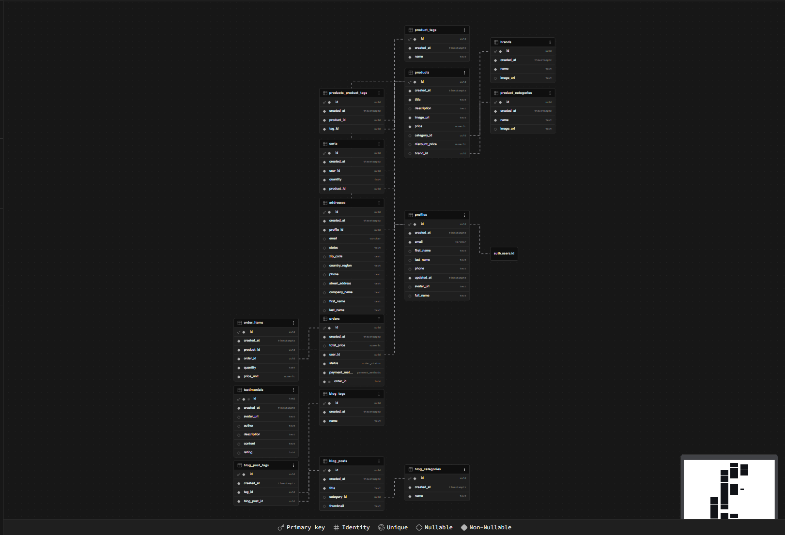

# 🛒 Ecobazar - Full Stack E-commerce Platform

Ecobazar is a high-performance, modern e-commerce solution for organic food trading. Built with the latest React 19 features and Tailwind CSS 4, it offers a seamless shopping experience powered by a robust Supabase backend.

## 🚀 Tech Stack

### Frontend

- React 19: Utilizing the latest concurrent rendering features and React Compiler for optimized performance.
- Tailwind CSS 4: Styled with the next generation of CSS-in-JS utility frameworks for ultra-fast styling.
- TanStack Query v5: Professional server-state management for caching, synchronization, and optimistic updates.
- React Router 7: Advanced routing with nested layouts and data loading patterns.
- Formik & Yup: Robust form management and schema-based validation.
- Swiper.js: Smooth, touch-enabled carousels and product sliders.

### Backend & Infrastructure

- Supabase: Cloud-hosted PostgreSQL database and authentication.
- Supabase JS Client: Secure, real-time communication between frontend and database.

## ✨ Key Features

- Comprehensive Auth System: Secure Signup, Login, Email Verification, and Password Reset flows.
- Dynamic Shopping Cart: Persistent cart logic with real-time price calculations and stock management.
- User Dashboard: Personal space for customers to track Order History, manage addresses, and update profiles.
- Advanced Product Filtering: Multi-criteria filtering by category, price range (Radix UI), and tags.
- Wishlist System: Save favorite products for later purchases.
- Responsive UI/UX: Fully optimized for mobile, tablet, and desktop views.
- Real-time Notifications: Instant feedback via react-hot-toast for user actions.

## 📁 Project Architecture

The project follows a Modular Clean Architecture to ensure scalability:

- src/components: Organized into UI, Sections, Common, and Modals for maximum reusability.
- src/contexts: Centralized state management for Auth, Cart, and Profile.
- src/hooks: Custom hooks (e.g., useInCart) to decouple business logic from UI components.
- src/pages: Structured by domain (Auth, Dashboard, Main) for clear navigation logic.
- src/data: Centralized JSON constants to maintain consistency across the app.

## 🗄️ Database Schema

The system relies on a well-structured relational database to ensure data integrity and performance.



## 🛠️ Installation & Setup

1. Clone the repository:
   ```bash
   git clone https://github.com/your-username/ecobazar.git
   ```
2. Install dependencies:
   ```bash
    npm install
   ```
3. Configure Environment Variables:

   Create a .env file in the root directory and add your Supabase credentials:

   ```bash
    VITE_SUPABASE_URL=your_supabase_url
    VITE_SUPABASE_PUBLISHABLE_DEFAULT_KEY=your_supabase_publishable_default_key
   ```

4. Run in development mode:
   ```bash
   npm run dev
   ```

## 🛡️ Best Practices Implemented

- Component Composition: Breaking down the UI into atomic, reusable components.
- Optimistic UI: Using TanStack Query to reflect changes instantly before server confirmation.
- Type Safety: Proper prop handling and clean logic separation.
- Performance: Leveraging React 19's latest optimizations to reduce re-renders.
